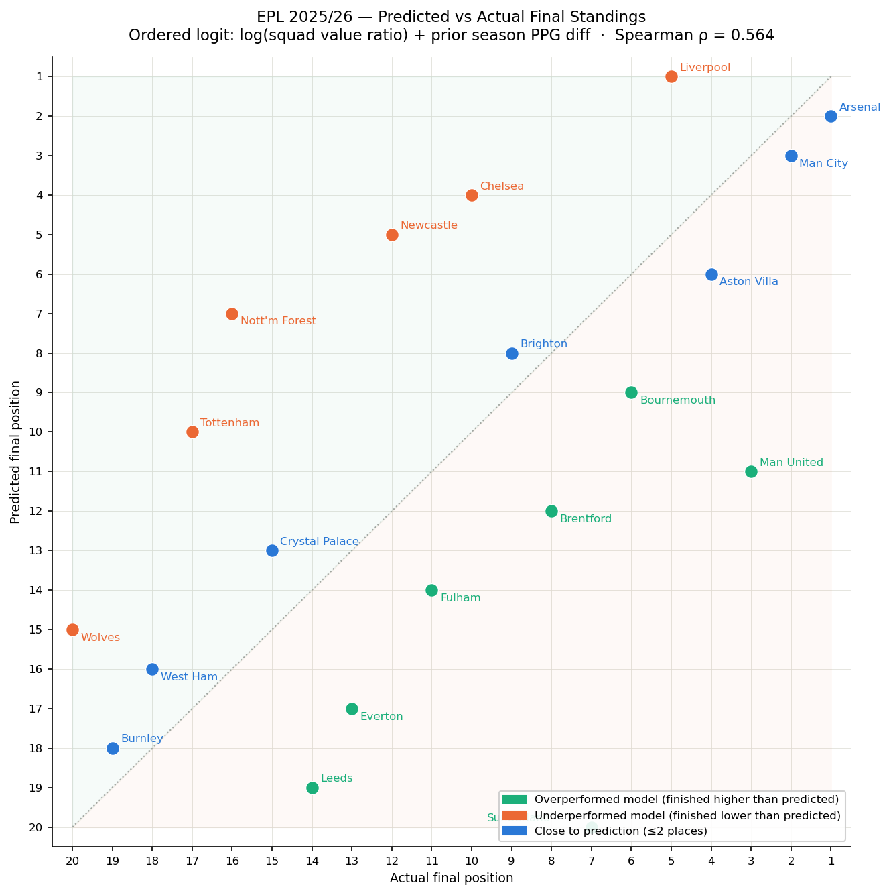
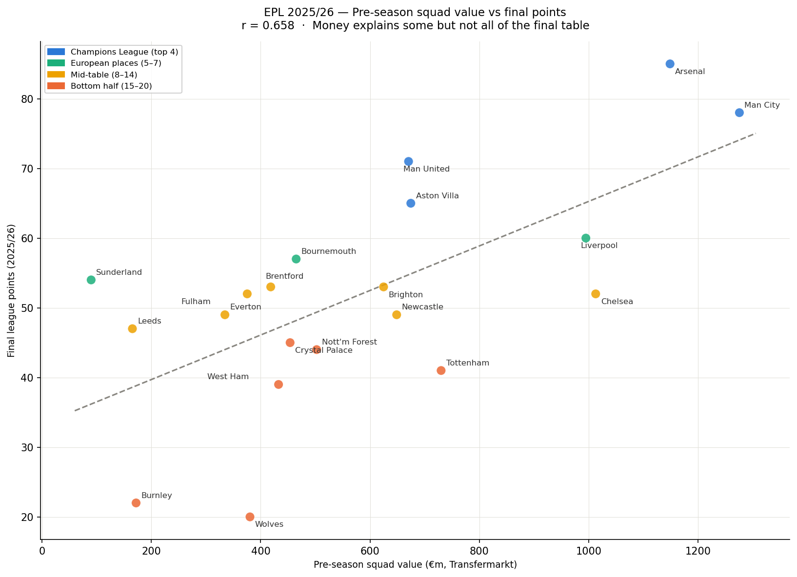

# EPL 2025/26 Season Predictor — Squad Value + Prior Form

Predicting EPL match outcomes and final standings using pre-season squad values and prior season form. Ordered logistic regression trained on six seasons (2019/20–2024/25), tested out-of-sample on 2025/26.

---

## The question

How much does money predict success in the Premier League? Can pre-season squad value — combined with prior season form — predict which teams finish where? And which teams over or underperformed their financial profile in 2025/26?

---

## Independent variables

**1. Log squad value ratio**

For each match, the natural log of the home team's pre-season squad value divided by the away team's squad value:

```
LogRatio = log(home_squad_value / away_squad_value)
```

Taking the log makes the ratio symmetric — a home team worth twice as much (ratio=2.0) is treated as equal and opposite to an away team worth twice as much (ratio=0.5). Zero means equal financial strength.

Squad values are built from Transfermarkt player valuations. For each season, the most recent valuation per player before September 1st is used — capturing the full summer transfer window. Only players whose most recent Transfermarkt record places them at an EPL club are included, preventing former players with stale club assignments from inflating squad totals.

**2. Prior season PPG difference**

The difference between home and away team points per game from the previous season:

```
PPG_diff = home_prior_PPG - away_prior_PPG
```

A positive value means the home team performed better last season. Captures form and momentum going into a new season, independently of squad financial strength.

**Promoted team adjustment:** teams promoted from the Championship have no EPL prior season PPG. Assigning their Championship PPG is inappropriate — the quality gap between leagues makes the numbers incomparable. Instead, promoted teams receive the historical average first-season EPL PPG across all promoted teams in the training data (0.83 points per game). This is data-driven rather than arbitrary.

---

## Dependent variable

Match outcome — ordered: Away Win < Draw < Home Win

**Why ordered logit?** The three outcomes sit on a natural ordered axis of home team performance. Ordered logistic regression models a single latent "home team strength" axis with two cut-points, which is more appropriate than treating the three outcomes as unrelated categories.

---

## Methodology

**Squad value snapshot:** September 1st cutoff captures the full summer transfer window (which closes August 31st). Each player's most recent Transfermarkt valuation before that date is used, filtered to players currently registered at an EPL club.

**Temporal split:**
- Train: 2019/20–2024/25 (2,250 matches)
- Test: 2025/26 (380 matches, fully out-of-sample)

The model never sees the test season during training, replicating a genuine pre-season prediction scenario.

**Standings simulation:** for each 2025/26 match, predicted probabilities are converted to expected points:

```
Expected points (home) = 3 × P(Home Win) + 1 × P(Draw) + 0 × P(Away Win)
```

Summed across all 38 matches per team to generate a predicted final table.

---

## Results

### Model coefficients

| Predictor | Coefficient | p-value | Interpretation |
|---|---|---|---|
| LogRatio | 0.431 | <0.001 | Higher relative squad value → more likely home win |
| PPG_diff | 0.544 | <0.001 | Better prior form → more likely home win |

Both predictors statistically significant. PPG_diff carries slightly more weight than LogRatio — prior form marginally outweighs financial strength once both are controlled for.

### Accuracy

| | Score |
|---|---|
| In-sample accuracy | 52.2% |
| Out-of-sample accuracy | 44.5% |
| Naive baseline (always "Home Win") | 43.6% |

### Brier Skill Scores (out-of-sample)

| Outcome | BSS |
|---|---|
| Home Win | +0.033 |
| Away Win | +0.026 |
| Draw | −0.011 |

Draws remain essentially unpredictable — consistent with the betting odds analysis in the companion project.

### Predicted vs Actual Standings

| Team | Actual | Predicted |
|---|---|---|
| Arsenal | 1 | 2 |
| Man City | 2 | 3 |
| Man United | 3 | 11 |
| Aston Villa | 4 | 6 |
| Liverpool | 5 | 1 |
| Bournemouth | 6 | 9 |
| Sunderland | 7 | 20 |
| Brentford | 8 | 12 |
| Brighton | 9 | 8 |
| Chelsea | 11 | 4 |
| Tottenham | 17 | 10 |
| Wolves | 20 | 15 |

**Spearman rank correlation: 0.531 (p=0.016)** — statistically significant. The model correctly identifies the broad structure of the table but misses individual team movements driven by non-financial factors.

### Key findings

**Money matters but explains less than half the variance.** Pre-season squad value correlates with final points at r=0.658. The top four (Arsenal, Man City, Man United, Aston Villa) all had the highest squad values. But the correlation is far from perfect.

**Prior form adds independent signal.** PPG_diff has a larger coefficient than LogRatio, meaning how well a team performed last season carries more predictive weight than how much their squad is worth, once both are in the model together.

**The biggest misses reveal what the model cannot see.** Sunderland (predicted 20th, finished 7th) overperformed their €90m squad value dramatically — promoted teams with new management, tactical cohesion, and momentum are invisible to a financial model. Chelsea (predicted 4th, finished 11th) underperformed a €1bn squad — also invisible to the model.

**Promoted teams are structurally underestimated.** Any pre-season model using squad value will predict promoted sides near the bottom. The promoted team PPG adjustment (0.83 fallback) partially addresses this but cannot account for individual team quality within the promoted group.

---

## Visualisations

**Chart 1 — Predicted vs Actual Standings**



Each dot is one team. x-axis = actual position, y-axis = predicted position. Teams above the diagonal (green) finished higher than predicted — they overperformed their financial profile. Teams below (orange) underperformed. The dotted line = perfect prediction.

**Chart 3 — Pre-season Squad Value vs Final Points**



One dot per team. x-axis = pre-season squad value (€m), y-axis = final points. Colour coded by finishing tier. r=0.658 shows meaningful but imperfect correlation — the notable outliers (Sunderland, Chelsea, Liverpool) tell the most interesting story.

---

## Honest limitations

**Squad value data quality.** Transfermarkt does not publish a single verified squad total per club per season. Values here are aggregated from individual player records, using the most recent valuation before September 1st. Players with infrequent updates may carry stale valuations; the cutoff ensures no post-transfer-window data is used.

**Sunderland and promoted teams.** No pre-season financial model can predict a promoted team finishing 7th. Sunderland's €90m squad was the smallest in the league but Glasner's tactical system, summer recruitment quality, and team cohesion are entirely unobserved by this model.

**Single predictor per team.** The model uses two pre-season features per match. In-season form, injuries, managerial changes, and fixture congestion are not incorporated. A richer model would add these as the season progresses.

**One test season.** Out-of-sample evaluation on a single season (2025/26) has limited statistical power. The Spearman correlation of 0.531 is meaningful but a single season contains genuine variance that no model can fully explain.

---

## Data sources

| File | Source |
|---|---|
| `player_valuations.xls` | [Transfermarkt via Kaggle](https://www.kaggle.com/datasets/davidcariboo/player-scores) — player valuations history |
| `epl_final.xls` | football-data.co.uk — EPL match results 2000/01–2024/25 |
| `season-2526.xls` | football-data.co.uk — EPL match results 2025/26 |

---

## Repo structure

```
├── epl_squad_value_predictor.py    full pipeline: data → model → charts
├── chart1_predicted_vs_actual.png  predicted vs actual standings
├── chart3_value_vs_points.png      squad value vs final points
└── README.md
```

**Run:**
```
python3 epl_squad_value_predictor.py
```

**Dependencies:**
```
pandas, numpy, matplotlib, statsmodels, scikit-learn, scipy
```

---

## Related projects

- [EPL 2526 Betting Odds Calibration](https://github.com/rafizrayhan/EPL-2526-Betting-Odds-Calibration) — comparing Bet365 implied probabilities against actual outcomes (r=0.868 for wins, R²=0.072 for draws)
- [EPL 2526 Betting Odds Brier Scores](https://github.com/rafizrayhan/EPL-2526-Betting-Odds-Brier-Scores) — Brier score evaluation confirming draw unpredictability (BSS=−0.006)
- [EPL Match Card Strictness Predictor](https://github.com/rafizrayhan/EPL-Match-Card-Strictness-Predictor) — ordered logit on 25 seasons of disciplinary data
- [Football Moneyball Valuation Model](https://github.com/rafizrayhan/Football-Moneyball-Valuation-Model) — OLS regression on striker market values

---

*Part of an ongoing self-directed sports analytics portfolio built alongside the University of Michigan Sports Performance Analytics Specialisation (Coursera).*
